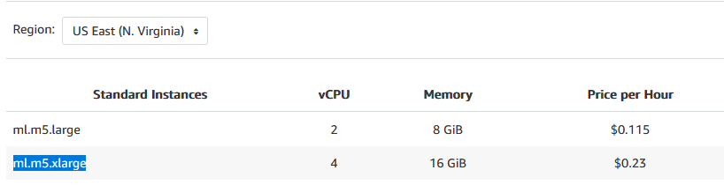
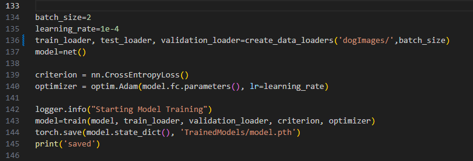
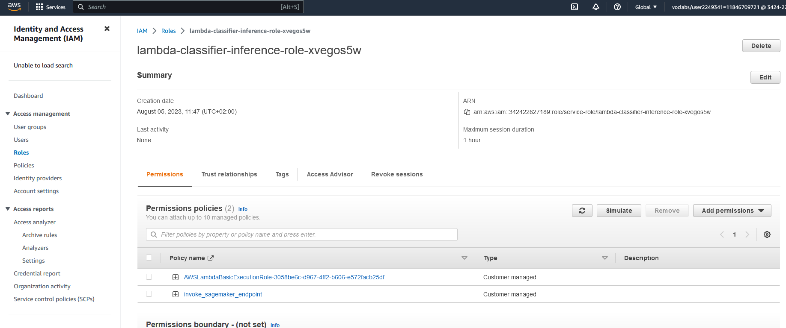
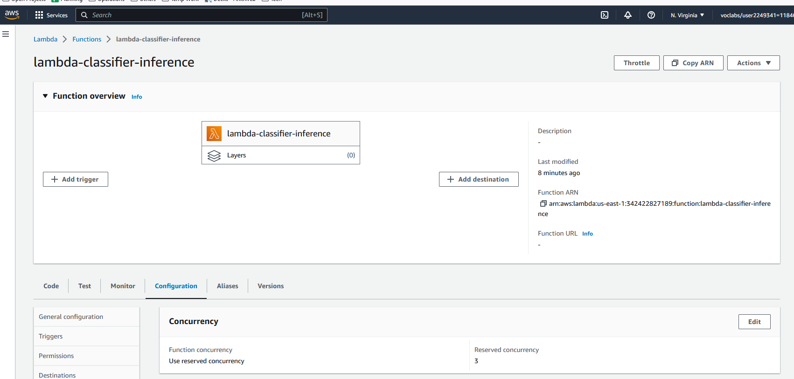
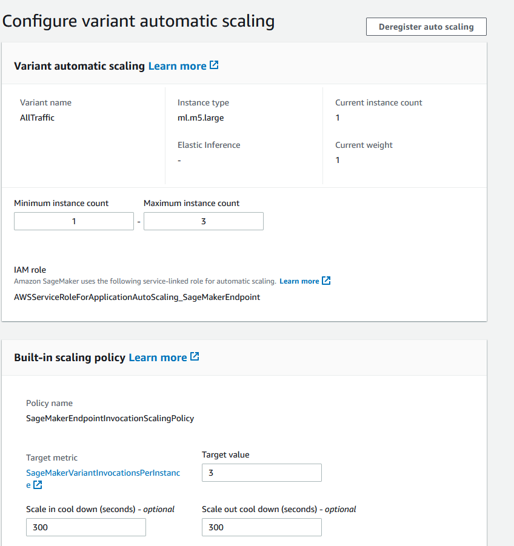

# Operationalizing ML Project

This project industrializes<br>
an image classification project<br> 
for production deployment.<br> 

This project was part of my Machine Learning Nanodegree at Udacity.<br>

- First, we train a model on Sagemaker utilizing multi-instance training in Sagemaker notebook.<br>
- Second, we adjust the Sagemaker notebook to perform training and deployment on EC2.<br>
- Third, we provide a lambda function as a proxy we can call from the internet<br>
to reach the private sagemaker inference endpoint and get back the prediction.<br>
together with configuring auto-scaling for deployed endpoint and concurrency of the lambda function.<br>
- Lastly, we test the end to end inference by calling the lambda endpoint.<br>

# Decision log
## SageMaker Instance
The selected notebook instance type is the ml.t3.medium.<br>
We don‘t need much processing power to run this notebook<br>
as we run the compute intenstive training on dedicated instances.<br>
The instance has 4GiB and 2vCPU, fast launch speed, and is part of free-trier initially<br> 
with the ongoing cost of  ~$1.2/day | $0.05/h in us-east-1 region.<br>
<br>

## EC2 Training Instance
The selected EC2 instance type is the ml.m5.xlarge<br>
which is the same we used for the training with the SageMaker Notebook<br>
where training took around 20 minutes in addition to 2 minutes launch time.<br>
The instance have 16GiB and 4vCPU with the ongoing cost of<br> 
~$5.52/day | $0.23/h in us-east-1 region.<br>
<br>

## Differences between code for SageMaker and EC2 Training Instance
On SageMaker instance we utilize SageMaker SDK with its functionalities<br>
as is creating of a training instance with SageMaker‘s PyTorch Estimator<br>
and passing the PyTorch training code as the entry point together with hyperparameters.<br>
In contrast, when we use EC2 instance to start and execute the training instead of SageMaker SDK<br>
we run there the PyTorch training code directly while defining hyperparameters as part of the code.<br>


Argparse arguments required in SageMaker but not on EC2 instance<br>

With SageMaker we use CloudWatch<br>
to log important metrics as validation metric which it then used for hyperparameters tuning<br>
and the training instance is turned off automatically after the training<br>
Contrary, the code that runs on EC2 stores the metrics and model locally<br>
and one needs to turn off the instance manually after the training.<br>

## Lambda function for inference
The lambda function serves here as a proxy we can call from the internet<br>
to reach the private sagemaker inference endpoint and get back the prediction.<br>
The SageMaker endpoints themselfs are not publicly exposed to the internet.<br><br>

**Lambda input format**<br>
The lambda function expects url to the image as an input<br>
```
{ "url": "https://s3.amazonaws.com/cdn-origin-etr.akc.org/wp-content/uploads/2017/11/20113314/Carolina-Dog-standing-outdoors.jpg" }
```
<br>

**Lambda response format**<br> 
```
Response
{
  "statusCode": 200,
  "headers": {
    "Content-Type": "text/plain",
    "Access-Control-Allow-Origin": "*"
  },
  "type-result": "<class 'str'>",
  "COntent-Type-In": "LambdaContext([aws_request_id=4fabc3a1-67aa-4642-8b3d-646a2fca0091,log_group_name=/aws/lambda/lambda-classifier-inference,log_stream_name=2023/08/05/[$LATEST]66377a4b0223437188a51e54ef36c0bc,function_name=lambda-classifier-inference,memory_limit_in_mb=128,function_version=$LATEST,invoked_function_arn=arn:aws:lambda:us-east-1:342422827189:function:lambda-classifier-inference,client_context=None,identity=CognitoIdentity([cognito_identity_id=None,cognito_identity_pool_id=None])])",
  "body": "[[-10.411001205444336, -3.359707832336426, -0.8716796040534973, -0.806928277015686, -4.352297782897949, -5.186327934265137, -1.495664358139038, 0.8672809600830078, -5.380954742431641, 1.8454653024673462, 0.4312936067581177, -3.658811330795288, -2.8765857219696045, 0.8555495142936707, -3.514918327331543, -2.7837865352630615, -3.0496015548706055, -0.40549755096435547, -3.7292232513427734, 2.481992244720459, -3.8871142864227295, -0.23016999661922455, -4.7074055671691895, -4.1295390129089355, -1.7130252122879028, -7.174082279205322, -0.8516669273376465, -3.8094027042388916, -6.795691013336182, -1.4744735956192017, -3.0278568267822266, -3.00732421875, -3.488715887069702, -2.308708906173706, -4.75553035736084, -3.2217209339141846, -5.662548542022705, -3.37078595161438, -1.3833039999008179, -3.1248347759246826, -0.4696883261203766, -4.379352569580078, -0.6068338751792908, -1.7910823822021484, -2.007514238357544, -7.800812244415283, -0.7701671719551086, -0.2863987386226654, -2.760631561279297, 1.4280922412872314, -0.8542321920394897, -3.884108304977417, -7.310881614685059, -0.4031883776187897, -7.083492279052734, -0.9902368783950806, -2.8704679012298584, -5.145750045776367, 1.2012884616851807, -0.9694129824638367, -4.938790798187256, -7.690269470214844, -8.024537086486816, -8.33481216430664, -0.7291134595870972, -4.421416282653809, 1.974891185760498, -3.7833690643310547, 0.42422670125961304, 0.04445834457874298, 1.4988248348236084, -4.184320449829102, -6.3427019119262695, -3.1247105598449707, -4.442811965942383, 0.2801550626754761, -4.49869966506958, -1.0993596315383911, -4.876307010650635, -5.119265079498291, -0.48293337225914, -7.715047836303711, 1.818647027015686, -1.0500093698501587, -6.889594554901123, -4.097452163696289, -0.9937998652458191, -4.184472560882568, -1.842955231666565, 0.07524902373552322, -6.111001014709473, -3.8210742473602295, -4.455970764160156, -4.266619682312012, -1.588929295539856, -0.21372069418430328, -3.720984935760498, -2.2540969848632812, -4.282245635986328, -3.6666383743286133, -5.490141868591309, 1.640966534614563, -1.159744143486023, -2.869694709777832, -3.370785713195801, -4.364036560058594, -1.3472678661346436, 0.28569215536117554, -0.7098796963691711, -1.6858900785446167, -1.6024034023284912, 0.3240872025489807, -4.126656532287598, -2.1658661365509033, -4.123987674713135, 0.5662287473678589, -8.372995376586914, -0.7134520411491394, -5.814210414886475, 0.7786624431610107, -2.9264795780181885, -3.000781774520874, -4.719344139099121, -5.324817180633545, -5.956800937652588, -1.7227917909622192, -2.3081328868865967, 0.5590783953666687, -2.500715970993042, -7.0961127281188965, -4.543877124786377, -0.22000989317893982, -2.8665199279785156]]"
}
```
<br>

**Security and vulnerabilities of the IAM configuration for the Lambda**<br>
The lambda is provisioned with IAM permission to invoke a sagemaker endpoint<br>
rather than SagemakerFullAccess thus limiting the attacker‘s scope to triggering endpoints.<br>
For convenience, the lambda can now trigger any endpoint in the account but this could be limited to a specific endpoint if the account would contain multiple endpoints.<br>
<br><br>

## Lambda Concurrency Configuration
By default, the account has a concurrency limit of 1,000 across all functions in a region.<br>
Here we make sure that at least 3 concurrent calls get always processed by this lambda function<br>
before relying on shared account concurrency pool of 997. If the inference would be latency-sensitive we could configure even provisioned concurrency to minimize lambda cold-starts.<br>
<br><br>

## Endpoint Autoscaling Configuration
To handle the low, but potentially variable traffic, the inference endpoint configuration was extended<br> 
to allow scaling to up to 3 inference endpoints to handle peak periods with minimal latency while scaling back when the peak is over.<br>

